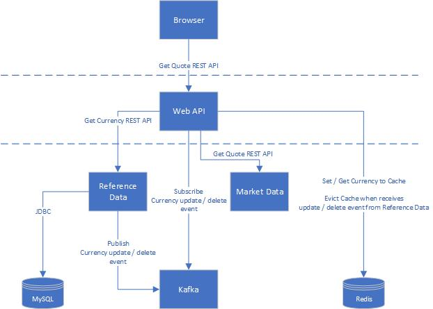

# springboot-ms
A simple application that demonstrates microservice development with spring boot

##### Design pattern
- Backend For Frontend (BFF) - A stateless application that acts as a single entry point for frontend application such as web application.  Upon receiving a request from consumer, it then calls various restful api(s), transform and aggregates the result.  BFF is not reusable in natrue and specifically for a particular page or use cases
- Interservice communication - Downstream services commicates with upstream services using restful api.  Upstream services communicates with downstream services with pub-sub in order to avoid cicular dependency
- Onion architecture - Protocol (rest / jms) Layer -> Service Layer -> Data Layer

##### Technologies
- Springboot data jpa for data persistence.  Disable OSIV and control transaction explicitly, usage of entity graph to reduce number of SQLs to execute
- Spring web for restful api developer
- Spring kafka to publish and subscribe domain events
- Spring cache redis to cache data
- Adopt contract first approach with openAPI generator to generate stub code and rest client from openapi specification
- Flyway migration to create database objects and initial data
- mapstruct for data transformation between different layers

##### Architecture

##### Quickstart
1. Setup the following infrastructure services (https://github.com/kc2wong/docker-for-dev)
   * 1.1. MySQL
   * 1.2. Redis
   * 1.3. Apache Kafka
2. Compile and deploy common library (https://github.com/kc2wong/springboot-ms/tree/main/library)
3. Compile and deploy reference-data-service (https://github.com/kc2wong/springboot-ms/tree/main/reference-data)
   * 3.1. Compile and deploy rest-client
   * 3.2. Start spring-boot service
4. Compile and deploy market-data-service (https://github.com/kc2wong/springboot-ms/tree/main/market-data)
   * 4.1. Compile and deploy rest-client
   * 4.2. Start spring-boot service
5. Compile and start web-api (https://github.com/kc2wong/springboot-ms/tree/main/web-api)

